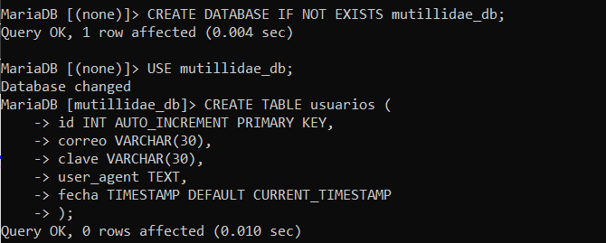
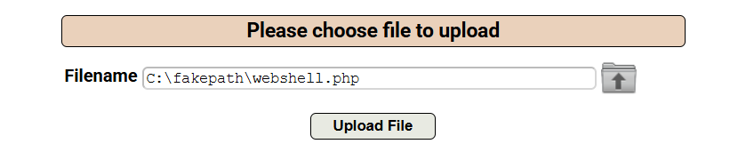
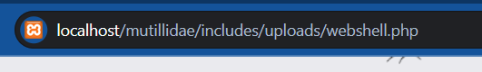
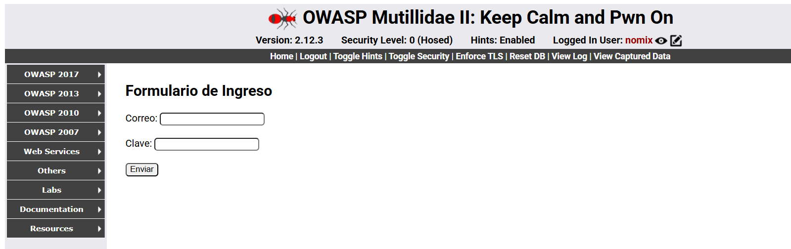

Pasos para ejecutar un script de php dentro de mutillidae ejecutandose en XAMPP

1. El primer paso es crear un archivo php que nos permitirá introducir un formulario que tomará información del sistema objetivo y después lo enviará a una base de datos.

(Un archivo php se incluye de ejemplo junto a los archivos de este repositorio)

2. Tenemos que crear una base de datos donde recolectar la información que obtengamos, los comandos para esto se muestran en la siguiente imagen. (La información de la base de datos ya debe estar incluida en el archivo php)

3. Seguidamente debemos de subir nuestro archivo utilizando la función de "Unrestricted File Uplaod" que nos ofrece el propio Mutillidae.

4. Después debemos introducir la ruta interna del propio mutillidae a la que nuestros archivos se subieron, esta informaición la debemos conocer con anticipación.

5. Cuando abramos esta página, nos aparecerá un formulario que podemos llenar nosotros mismos y que aparte obtendrá información sobre el USER AGENT del propio sistema

